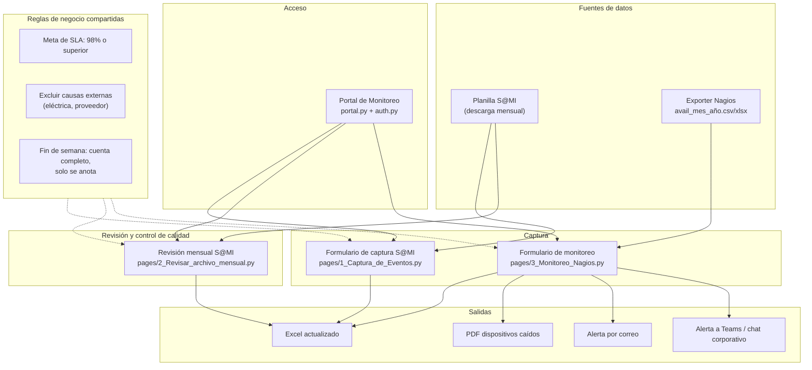

# Documentación — Herramientas de SLA (S@MI y Monitoreo)

Este documento describe el conjunto de herramientas construidas para gestionar el
cumplimiento del SLA de disponibilidad (meta: **98% o superior**) a partir de dos
fuentes de datos distintas: la Planilla Control de Eventos S@MI (incidencias) y el
exporter de monitoreo tipo Nagios (disponibilidad por dispositivo).

## 1. Alcance y supuestos abiertos

Varias decisiones de esta versión se tomaron **sin confirmación explícita** porque
las preguntas de aclaración no fueron respondidas. Quedan documentadas aquí para
que se puedan corregir sin tener que releer el código:

| Punto | Supuesto tomado | A confirmar |
|---|---|---|
| Formulario de monitoreo | Es una herramienta **nueva y separada** del formulario S@MI, con el esquema de `avail.csv` de Analisis-Python.1 (HOST_NAME, %UP, %DOWN) | ¿Es correcto, o el monitoreo debía integrarse dentro del mismo formulario S@MI? |
| Un archivo de monitoreo | Contiene **todas las categorías** (incluida Portales) en una sola hoja, un archivo por mes | ¿O se espera un archivo por plataforma? |
| Plantilla Portales | Se implementó como una **Categoría más** dentro del formulario de monitoreo (con la etiqueta de campo cambiando a "URL del portal") | ¿O se esperaba un archivo/plantilla totalmente separada? |
| Dispositivos caídos (PDF) | Se calculan sobre los datos del **formulario de monitoreo** (Nagios), no sobre las incidencias S@MI | ¿Es la fuente correcta? |
| Alertamiento | Correo (SMTP) y webhook genérico (compatible con Teams, Slack y Google Chat), **siempre disparado manualmente** con un botón, nunca automático/desatendido | ¿Se necesita también un disparo automático programado (cron)? Eso requeriría guardar credenciales de forma persistente, fuera del alcance actual |
| "Chat corporativo" | Se interpretó como sinónimo de Teams (mismo mecanismo de webhook) | Si es una plataforma distinta a Teams, confirmar cuál |
| Portal / login | Clave única compartida (`PORTAL_PASSWORD`), no un sistema de usuarios con roles ni un admin que crea cuentas — ver sección 3 | ¿Se necesita autenticación real con cuentas individuales? Es una decisión de seguridad que debe confirmarse explícitamente antes de construirla |
| Menú del portal | Las tarjetas apuntan a las tres herramientas ya construidas (Captura, Revisión, Monitoreo), no a las categorías del boceto original (Servidores/Red/Portales/Usuarios) | ¿Se esperaban esas categorías específicas como módulos independientes? |

## 2. Las cuatro piezas

### 2.0 Portal de Monitoreo (`portal.py`)

Pantalla de entrada: una tarjeta de acceso (clave única, opcional) y un menú con
tres tarjetas de color — una por herramienta — inspirado en el boceto que trajo el
usuario. Ver sección 3 para el detalle del login.

### 2.1 Formulario de captura de eventos S@MI (`pages/1_Captura_de_Eventos.py`)

Formulario para registrar incidencias nuevas en la Planilla S@MI a medida que
ocurren. Fechas y horas se capturan con selector (nunca texto libre), evitando de
raíz el error de "hora digitada en el formato equivocado" que motivó la revisión
mensual. Válida campos obligatorios y consistencia cronológica antes de guardar
cualquier evento.

### 2.2 Revisión del archivo mensual S@MI (`pages/2_Revisar_archivo_mensual.py`)

Para el rol de revisor: se carga el archivo ya diligenciado del mes, se detectan
filas con problemas (campos vacíos, `Fin` anterior a `Inicio`), se pueden corregir
directamente en una tabla editable, y se calculan dos disponibilidades separadas:

- **Total**: todas las horas de caída cuentan.
- **Ajustada**: excluye las incidencias marcadas como "no controladas" (p. ej.
  causa eléctrica, Tigo/Une como proveedor externo).

Cada fila que inicia en sábado o domingo recibe automáticamente una nota
("Incidente iniciado en fin de semana... no se descuenta tiempo") — **las horas de
caída de fin de semana cuentan completas**, la nota es solo informativa/de
trazabilidad, nunca reduce el cálculo.

### 2.3 Formulario de monitoreo tipo Nagios (`pages/3_Monitoreo_Nagios.py`)

Herramienta nueva, independiente de la Planilla S@MI, para el reporte de
disponibilidad por dispositivo que produce el monitoreo (Nagios): HOST_NAME (o URL,
para la categoría Portales), % arriba, % abajo, y opcionalmente % inalcanzable /
indeterminado y causa. Guarda en Excel con el **estándar de nombres**
`avail_<mes>_<año>.xlsx` (ver `monitoreo_naming.py`).

Desde aquí se puede:

- Ver el cumplimiento de SLA agregado y por categoría.
- Descargar un **PDF de dispositivos caídos** (`monitoreo_pdf.py`), separando los
  que cuentan contra el SLA de los excluidos por causa externa.
- Disparar una **alerta manual** por correo o por webhook de chat corporativo
  cuando una categoría está por debajo de la meta (ver sección 4).

## 3. Portal y control de acceso

`portal.py` es la página de entrada (la que abre `main.py`). Muestra una tarjeta
de acceso y, al pasarla, un menú con una tarjeta de color por herramienta
(`theme.py` trae el tema visual oscuro compartido por toda la app).

**El acceso es una cortina simple, no un sistema de usuarios.** `auth.py`
compara la clave ingresada contra una única variable de entorno
`PORTAL_PASSWORD` (ver `.env.example`). Si esa variable no está configurada, el
portal queda abierto sin pedir nada — útil para desarrollo local. Cada
subpágina llama a `require_auth()` al inicio, así que no se puede saltar la
pantalla de acceso navegando directo a la URL de una herramienta.

Esto fue una decisión deliberada frente al boceto original, que mostraba un
login con usuario/contraseña y un administrador que crea cuentas: eso implica
guardar contraseñas de forma segura (hash, sal, rotación) y gestionar roles —
una superficie de seguridad real que no debía improvisarse sin confirmación
explícita. Si se necesita autenticación real con cuentas individuales, es un
cambio aparte que vale la pena revisar con cuidado antes de construir.

## 4. Reglas de negocio compartidas

Estas reglas se aplican de forma consistente en las tres herramientas:

1. **Meta de SLA: 98% o superior** (`SLA_OBJETIVO` en `schema.py` y
   `monitoreo_schema.py`).
2. **Las causas externas se excluyen del SLA** (no cuentan como incumplimiento):
   fallas eléctricas, de proveedor (Tigo, Une), de terceros, o mantenimiento
   programado. La sugerencia es automática por palabras clave en la Causa
   (`PALABRAS_NO_CONTROLADO` en `review.py`), pero la decisión final la confirma
   la persona revisora — nunca se excluye nada en silencio.
3. **Las fallas de fin de semana sí cuentan** — no se les resta tiempo. Solo se dejan
   documentadas con una nota indicando que se evaluaron hasta el primer día hábil
   siguiente.
4. El nombre del analista se muestra y se guarda **sin el turno** (`Nombre`, no
   `Nombre / 06:00 - 14:00`).

## 5. Alertamiento — qué es viable y cómo se implementó

**Respuesta a "validar si se puede hacer un alertamiento": sí es viable.**
Está implementado en `alertas.py` con dos canales:

- **Correo (SMTP)**: `enviar_correo()`, requiere configurar `SMTP_HOST`,
  `SMTP_PORT`, `SMTP_USER`, `SMTP_PASSWORD`, `SMTP_FROM` como variables de entorno
  (ver `.env.example`).
- **Webhook de chat corporativo**: `enviar_webhook()`, compatible con Teams, Slack
  y Google Chat (los tres aceptan el mismo formato `{"text": "..."}`), requiere
  `ALERTAS_WEBHOOK_URL`.

**Diseño deliberado de seguridad:** ninguna credencial se pide por el chat de
Claude ni queda escrita en el código; se leen únicamente de variables de entorno
que la persona usuaria configura en su propio equipo. El envío es **siempre
manual**: la app solo calcula qué alertas corresponden y las muestra; enviarlas
requiere que la persona usuaria haga clic en un botón. No hay ningún disparo
automático/desatendido — eso requeriría guardar credenciales como configuración
permanente, lo cual queda fuera de este cambio hasta que se confirme
explícitamente que se quiere.

## 6. Estándar de nombramiento del exporter de Nagios

```
avail_<mes>_<año>.xlsx
```

- `mes` en español, minúsculas, sin tildes (enero, febrero, ..., diciembre).
- `año` de 4 dígitos.
- Ejemplo: `avail_julio_2026.xlsx`.

Implementado en `monitoreo_naming.py`:

- `nombre_archivo_avail(mes, año)` construye el nombre estándar.
- `es_nombre_valido(nombre)` valida si un nombre ya existente sigue el estándar.
- `descomponer_nombre(nombre)` extrae mes/año de un nombre válido.

La página de monitoreo avisa con una advertencia visible si el archivo cargado no
sigue el estándar, sin bloquear el trabajo.

## 7. Arquitectura



(También publicado como página interactiva — ver enlace entregado junto con este
documento.)

## 8. Módulos y dónde está cada cosa

| Archivo | Responsabilidad |
|---|---|
| `portal.py` | Página: pantalla de acceso y menú de tarjetas hacia las tres herramientas |
| `auth.py` | Verificación de la clave de acceso simple, gate reutilizado por cada página |
| `theme.py` | Tema visual oscuro compartido (CSS) y las tarjetas del menú |
| `schema.py` | Estructura de columnas de la Planilla S@MI, meta de SLA |
| `workbook_io.py` | Lectura/escritura del libro S@MI, listas desplegables, limpieza de nombre de analista |
| `validation.py` | Reglas de validación de un evento S@MI nuevo |
| `review.py` | Escaneo, detección de problemas, sugerencia de "no controlado", nota de fin de semana |
| `pages/1_Captura_de_Eventos.py` | Página: captura de eventos S@MI |
| `pages/2_Revisar_archivo_mensual.py` | Página: revisión del archivo mensual S@MI |
| `monitoreo_schema.py` | Estructura de columnas del monitoreo Nagios, categorías, meta de SLA |
| `monitoreo_naming.py` | Estándar de nombres `avail_mes_año` |
| `monitoreo_validation.py` | Reglas de validación de un dispositivo de monitoreo |
| `monitoreo_io.py` | Lectura/escritura del libro de monitoreo, cálculo de dispositivos caídos |
| `monitoreo_pdf.py` | Reporte PDF de dispositivos caídos |
| `alertas.py` | Evaluación de alertas de SLA, envío por correo y webhook |
| `pages/3_Monitoreo_Nagios.py` | Página: captura de monitoreo, alertas, PDF |
| `.env.example` | Plantilla de variables de entorno para acceso y alertamiento |
| `repair_source.py` | Reparación de errores conocidos del archivo S@MI original |

## 9. Instalación y ejecución

```powershell
py -m pip install -r requirements.txt
py main.py
```

Abre `http://localhost:8501`. Aparece primero el Portal de Monitoreo; desde ahí
se entra a las tres herramientas.

Para proteger el portal con una clave y/o habilitar el alertamiento, copia
`.env.example` a `.env` (o define esas variables de entorno de otra forma) y
completa `PORTAL_PASSWORD` y/o tus credenciales SMTP y URL de webhook.

## 10. Pruebas

```powershell
py -m pip install -r requirements.txt pytest
py -m pytest qa -v
```

82 pruebas automáticas cubren: acceso al portal, validación de eventos S@MI,
lectura/escritura del libro S@MI, revisión y clasificación "no controlado", nota
de fin de semana, estándar de nombres de monitoreo, validación y cálculo de
dispositivos de monitoreo, generación de PDF, y evaluación/envío de alertas (con
mocks, sin credenciales reales ni llamadas de red).
